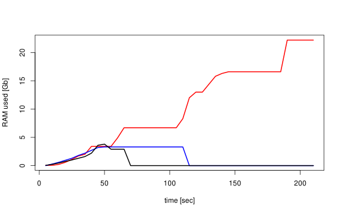

# dense2sparse

A rust program to convert a dense ',' or '\t' separated table to the Matrix Marked spasre matrix format.
Only integer values are supported. Float values as provided by some databases are converted to ints.

A preprint of this is available on [ResearchGate](https://www.researchgate.net/publication/368667970_dense2sparse_a_Rust_program_to_convert_published_SingleCell_dense_matrices_to_the_MatrixMarket_format)
# Usage

```
dense2sparse -h
dense2sparse 0.1.0
Stefan L. <stefan.lang@med.lu.se>
Convert a dense csv table to the MatrixMarket format used by 10x CellRanger. Meaning the outfiles
are matrix.mtx.gz, features.tsv.gz and barcodes.tsv.gz. To circumvent problems while importing into
Scanpy the files are created in a folder named 'filtered_feature_bc_matrix'

USAGE:
    dense2sparse.exe [OPTIONS] --ipath <IPATH>

OPTIONS:
    -h, --help                     Print help information
    -i, --ipath <IPATH>            the input input path
    -s, --sep <SEP>                the column separator str [default: ,]
    -t, --transpose <TRANSPOSE>    transpose the data [default: false]
    -V, --version                  Print version information
```

```
alevin210x -h
dense2sparse 0.1.0
Stefan L. <stefan.lang@med.lu.se>
alevin-fry (a single cell quantification tool written in Rust) creates MatrixMarket outfiles that
are not conform with the 10x Cellranger standard. This format is not supported by the main analyis
packages and therfore this tool converts alevin-fry style matrices to CellRanger style MatrixMarket
format

USAGE:
    alevin210x.exe --ipath <IPATH>

OPTIONS:
    -h, --help             Print help information
    -i, --ipath <IPATH>    the input input path
    -V, --version          Print version information
```


# Install

1. Clone this repo.

In this repo you then do:

```
cargo build -r
sudo cp target/release/dense2sparse /usr/bin/
sudo cp target/release/alevin210x /usr/bin/
```

You can of cause also use the target/release/dense_2_sparse program from the original point or copy it somewhere else.


## Testing

```
cargo build -r
target/release/dense2sparse -i testData -s "\t"
Rscript testData/Rtest.R
Rscript testData/Rtest_transp.R
```

This output is expected:

```
Processing file "testData/DenseMatrix.csv"
I have detected 300 columns
100 columns 300 rows and 2693 data points read
sparse Matrix: 300 cell(s), 100 gene(s) and 100 entries written to path Ok("testData/DenseMatrix/filtered_feature_bc_matrix"); 
Attaching SeuratObject
[1] "OK"
```

## Speed

Using the 3,2G big GSE166895_postQC_mRNAraw_FL-FBM-CB.csv file from the Human Cell Atlast database (Bone -> "Blood and immune development in human fetal bone marrow and Down syndrome" )
takes 1min 46 sec on one core of an AMD Ryzen 5 3600X 6-Core Processor using Ubuntu 22.04.1 LTS with cernel Linux 5.15.0-58-generic and a magnetic disk as storage.

This is quite impressive - or?


## Memory Usage



Memory usage measured over time using top program on Linux. Shown is the top value 'RES' measured every 5 seconds for a R dense to sparse conversion [red], the dense2sparse Rust process for the same data [blue] and the loading of the sparse matrix into R [black]. The file GSE166895_postQC_mRNAraw_FL-FBM-CB.csv from \cite{humdata} was used for these measurements